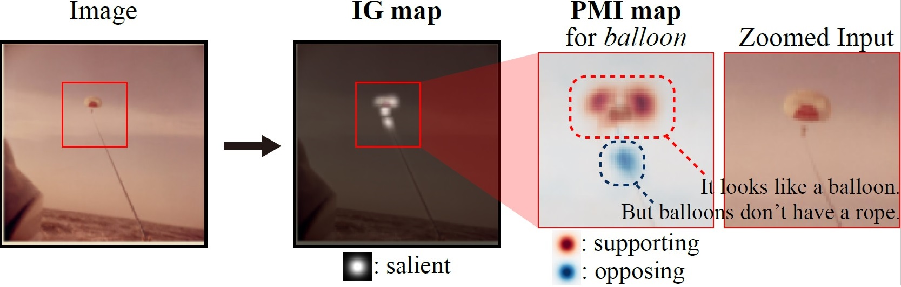

# Information-Theoretic Visual Explanation
A tensorflow implementation of "Information-Theoretic Visual Explanation for Black-Box Classifiers"


## Example
An *parachute* image was classified as a *balloon*.

- The **IG map** provides a class-independent explanation: the classifier made a decision based on the highlighted object (the parachute and the rope).
- The **PMI map** provides a class-specific explanation for the *balloon* class: the orange fabric looks a balloon, but the rope doesn't.





## Compatibility

The code runs on python 3.7 and tensorflow 1.13.1.
 

## Installation


#### Step 1. Install libraries.
- Install [required libraries](requirements.txt).

#### Step 2. Download model checkpoints.
- Download [ckpts.zip](https://drive.google.com/file/d/1xa8PVlsy6TRuT2EdFI3Z_loWwOhGRq8U/view?usp=sharing) and unzip the file.
- The zip file contains model checkpoints VGG19 (converted from pytorch model zoo to tensorflow) and trained **PatchSampler**. 


## Code examples

#### Step 1. Obtain the PMI and IG maps.

```bash
python main.py --image_path="data/parachute.png"
```

- `image_path` denotes the path to the image to explain.


#### Step 2. Check out the saved results in [data/results/](data/results).

The examples of the PMI and IG maps are provided in [data/results/parachute_K8_N8_S1.png](data/results/parachute_K8_N8_S1.png)
